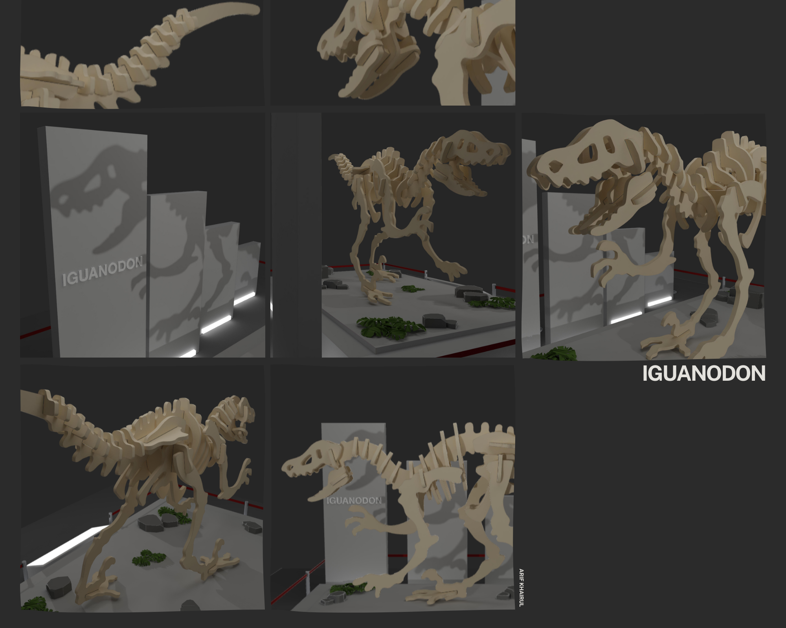

# Prehistoric World Museum - Iguanodon



Step into a prehistoric world with the 3D dinosaur museum. Roar with the dinosaur from your browser. Thanks to [Bruno Simon](https://bruno-simon.com/) for the best course on [Three.js Journey](https://threejs-journey.com/).

## Setup
Download [Node.js](https://nodejs.org/). Run this followed commands:
``` bash
# Install dependencies (only for first time) | [node_modules] folder
npm install

# Run the local server at localhost:5173
npm run dev

# Build for production | [dist] folder
npm run build
```
